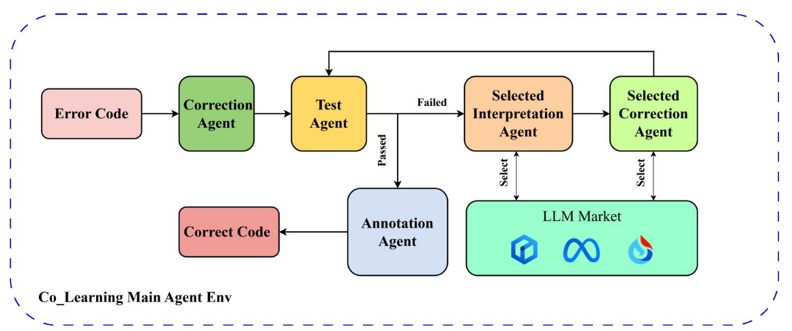
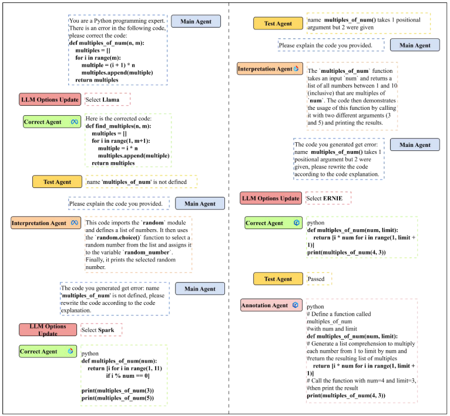

# Co-Learning: Code Learning for Multi-Agent reinforcement Collaborative Framework with Conversational Natural Language Interfaces


## Framework Overview
The Co-Learning framework consists of five key agents:
1. **Main Agent**: Supervises and interacts with users.
2. **Correction Agent**: Revises and corrects code.
3. **Interpretation Agent**: Explains programming logic to identify incorrect code.
4. **Test Agent**: Tests the corrected code.
5. **Annotation Agent**: Adds comments to the revised code for better user understanding.

These agents communicate through conversational interfaces, and the system employs Environmental Reinforcement Learning (E-RL) to self-improve and provide feedback to both the agents and human users. The Co-Learning framework utilizes models such as ERNIE, SparkDesk, and LLaMa for different agents, and it evaluates code correction performance using criteria such as passing probability tests, single loop computation time, and the number of required loops.

## Key Contributions
1. Development of a Multi-Agent framework using multiple LLMs for code error correction.
2. Evaluation of LLM performance using an original dataset containing 702 error codes.
3. Exploration of reinforcement learning in a multi-agent environment based on large language models.
4. Benchmarking against existing frameworks, demonstrating significant improvements in accuracy and operating speed.

## Workflow
The Co-Learning framework operates within an environment created by the Main Agent. The workflow is as follows:
- The **Correction Agent** uses a default LLM to make an initial correction to the input error code.
- The **Test Agent** then evaluates the corrected code using test samples. If the code passes all tests, it is sent to the **Annotation Agent** for final annotation and output. 
- If the code fails any test, it is passed to the **Interpretation Agent** for further analysis. This process is stored in memory as an E-RL prompt.
- The system then selects the appropriate Correction Agent using reinforcement learning and generates a new code based on the memorized data and interpretation, forming a loop until the code passes all tests.

The system is designed to enhance code error correction by mimicking human debugging processes and adapting in real-time to select the most appropriate LLM model based on E-RL.

## Dataset
We hope that this dataset (we create) can serve as a valuable resource for further research and development in the field of code error correction, enabling the creation of more robust and efficient automated programming tools. You can find our dataset in the [dataset folder](./dataset/) which includes 702 error code samples used for evaluation.

## API Key Acquisition

To utilize the APIs required for this project, you need to obtain the necessary API keys. Follow the instructions below to get started:

### 1. Baidu API Key

   - **Step 1:** Visit the [Baidu AI Open Platform](https://ai.baidu.com/).
   - **Step 2:** Log in or sign up for a Baidu account.
   - **Step 3:** After logging in, navigate to the "Console" (控制台) to create a new application.
   - **Step 4:** Under "Application Management" (应用管理), select "Create Application" (创建应用).
   - **Step 5:** Choose the services you need (such as NLP, OCR, etc.) and then you will be provided with an API Key and Secret Key.

   You can access the platform and start the process here: [Baidu AI Open Platform](https://ai.baidu.com/).

### 2. Spark API Key

   - **Step 1:** Visit the [iFLYTEK Open Platform](https://www.xfyun.cn/).
   - **Step 2:** Log in or sign up for an iFLYTEK account.
   - **Step 3:** Once logged in, navigate to the "Console" (控制台).
   - **Step 4:** Under "My Applications" (我的应用), click on "Create Application" (创建应用).
   - **Step 5:** After creating the application, you will be able to access the API Key, Secret Key, and App ID.

   Start the process to obtain your Spark API key here: [iFLYTEK Open Platform](https://www.xfyun.cn/).

## Getting Started

To get started with the Co-Learning framework, you can clone this repository and follow the setup instructions provided.

```bash
git clone https://github.com/yuqian2003/Co_Learning.git
cd Co_Learning
```

```bash
python Co_learning.py
```

## Case Study


## Citation

If you use this code in your research, please cite the following paper:

```bibtex
@article{colearning2024,
  title={Co-Learning: Code Learning for Multi-Agent reinforcement Collaborative Framework with},
  author={Jiapeng Yu, Yuqian Wu, Yajing Zhan, Wenhao Guo, Zhou Xu, Raymond Lee},
  journal={Frontiers in AI},
  year={2024},
  url={https://github.com/yuqian2003/MAS4POI}
}
```
# Acknowledgments:
This research was supported by *Beijing Normal University-Hong Kong Baptist University United International College (UIC)* and the *IRADs lab*. 
The authors express their gratitude for providing the necessary computational facilities.
